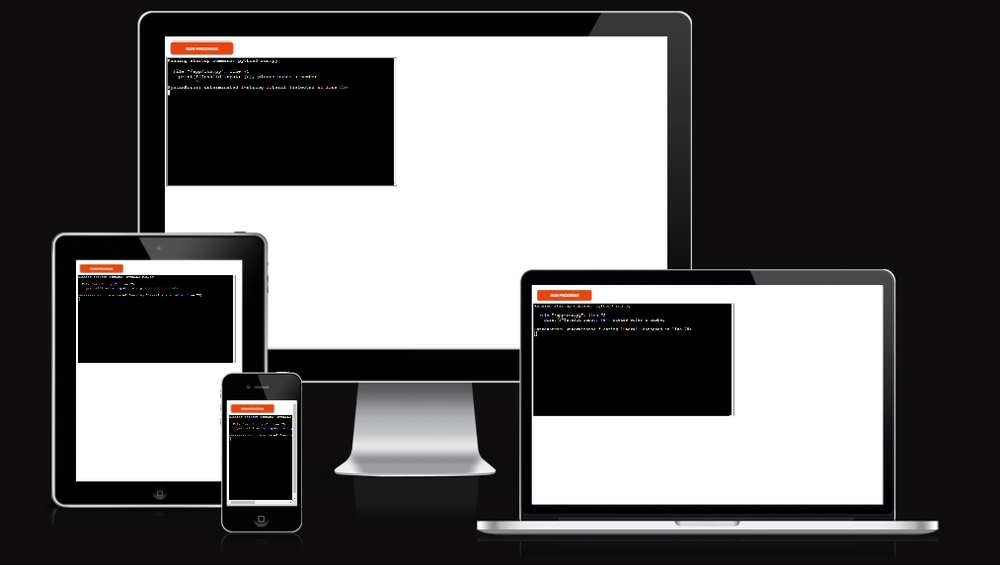
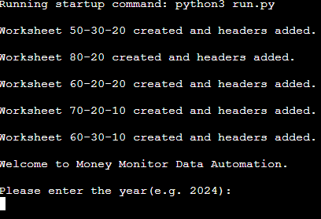
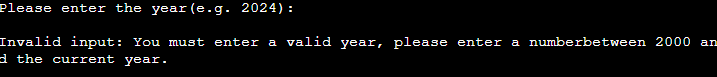
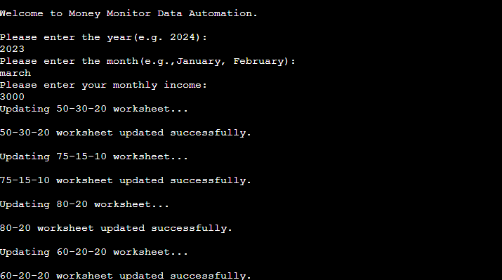
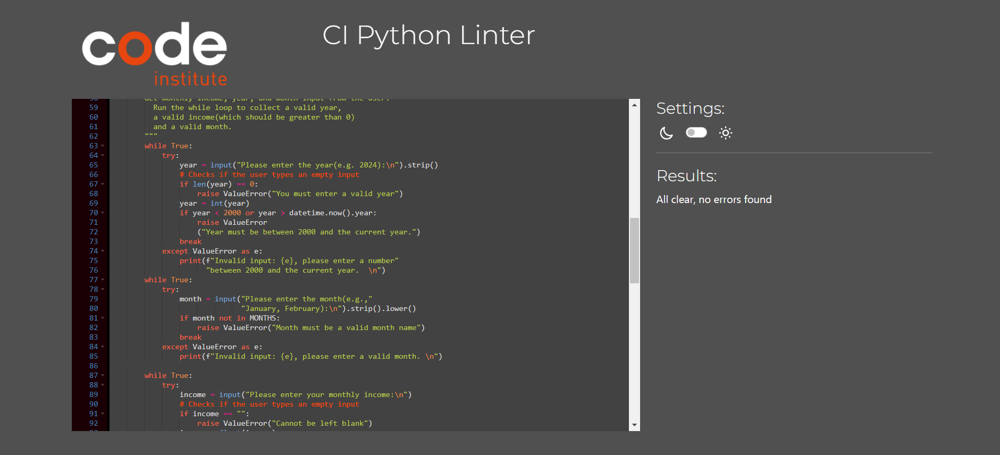

# Money Monitor

Visit the site deployed on heroku: [MoneyMonitor](https://moneymonitor-c73e0918c5c9.herokuapp.com/)

# CONTENTS

- [How To use](#how-to-use)

- [Features](#features)

  - [Existing Features](#existing-features)
  - [Future Features](#future-features)

- [Data Model](#data-model)
- [Bugs](#bugs)

  - [Solved Bugs](#solved-bugs)
  - [Remaining Bugs](#remaining-bugs)
- [Validator Testing](#Validator-testing)
- [Deployment](#deployment)
- [Credits](#credits)

## How To Use

- Run the program
- Enter a valid year, month and monthly income. Ensure that the input income is a positive number representing your total monthly earnings.
- Select your preferred budgeting strategy from the available options. The program offers various predefined budgeting rules, such as the 50-30-20 rule or the 75-15-10 rule, which allocate a percentage of your income to different expense categories.
- You can run the program multiple times to update your financial data for different months or income changes. Simply follow the same steps each time to input new data and track your budgeting progress over time.
- You can access the Google Sheets associated with your account to view detailed financial information and track your budgeting progress over time. The program automatically updates the Sheets with each new input, allowing you to monitor your money.

## Features

### Existing Features

- The program creates the worksheets if theese doesn't exist. 
    
- The program includes error handling with messages.

- Checks empty inputs or invalid inputs.

- It provides informative messages, such as confirming successful worksheet updates or notifying users when data already exists.

### Future Features

- Graph for spendings.
- Monthly summary report. Easy for the user to check which rule suits best for him.

## Data Model

1. Worksheets: Each worksheets in the Google Sheets represents a different money alocation rule.

2. Headers: Each worksheet contains headers specifying information for each column such as:
    - Year: The year corresponding to the financial data
    - Month: The month corresponding to the financial data
    - Income: The income for the month
    - Needs: The amount for essential expenses
    - Wants: The amount for non-esential expenses
    - Savings: The amount allocated for savings.

3. User Input: The program allows the user to input their monthly income, year and month. Based on the input, the program calculates the amount of money according to each rule and updates the worksheet with data.

4. Money Monitor Rules: Each rule dictates how the income should be alocated(For example, for "50-30-20" rule, 50% should go into needs, 30% for wants and 20% to savings.)

## Bugs

### Solved Bugs

1. Fixed input validation. 
    - The program didn't handle empty or invalid inputs.
    - To solve this bug, input was checked for empty entries and a message is displayed.

2. Fixed duplicate entries for the same year and month
    - The program didn't handle duplicate entries.
    - To solve this bug, the propram now checks the existing data, preventing duplicate entries and display a message if same year and month are already in the worksheet.
3. Worksheets 
    - Initially, there was a bug where the program did not created the worksheets if they didn't exist
    - To solve this bug, I created a function to check and create the worksheets.
4. Month input(Uppercase or lowercase)
    - Initially, there was a bug where the program raised an error even if the user types the month with lowercase
    - To solve this bug, I used the lower() functinon. It alows the user to input a month in any case.

### Remaining Bugs

- No known remaining bugs.

## Validator Testing

- CODE INSTITUTE PEP8
    - no errors found when using [CI Python Linter](https://pep8ci.herokuapp.com/#)
    

## Deployment 

This project was deployed using Code Institute's mock terminal for Heroku.

- Steps for deployment:
    - Fork or clone this repository
    - Create a new Heroku app
    - Set the buildback to Python and NodeJS in that order
    - Link the Heroku app to repository
    - Click on Deploy

## Credits

- CODE INSTITUTE for the deployment terminal and for love-sandwiches project which insipired me to do similar type of project
- Google: Google Sheets API and libraries, which are esential for this project
- Wikipedia for money allocation rules
- GitHub: Hosting the project repository
- StackOverflow
- CODE INSTITUTE Slack Group